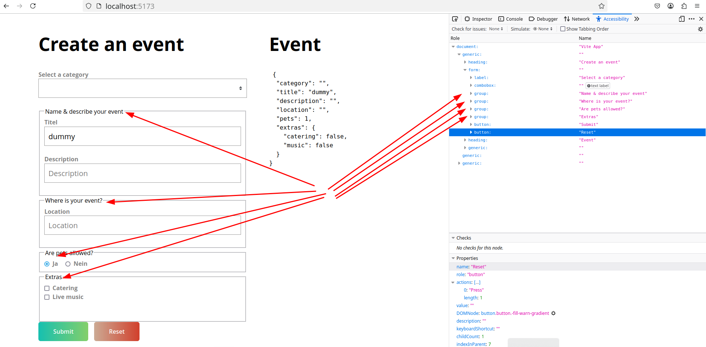
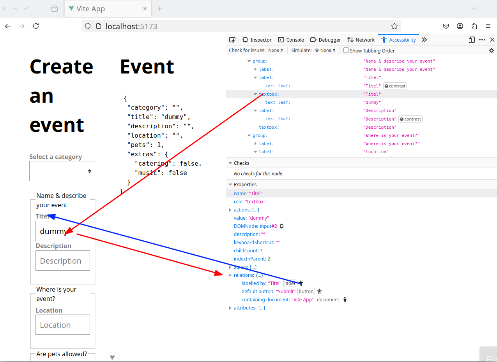
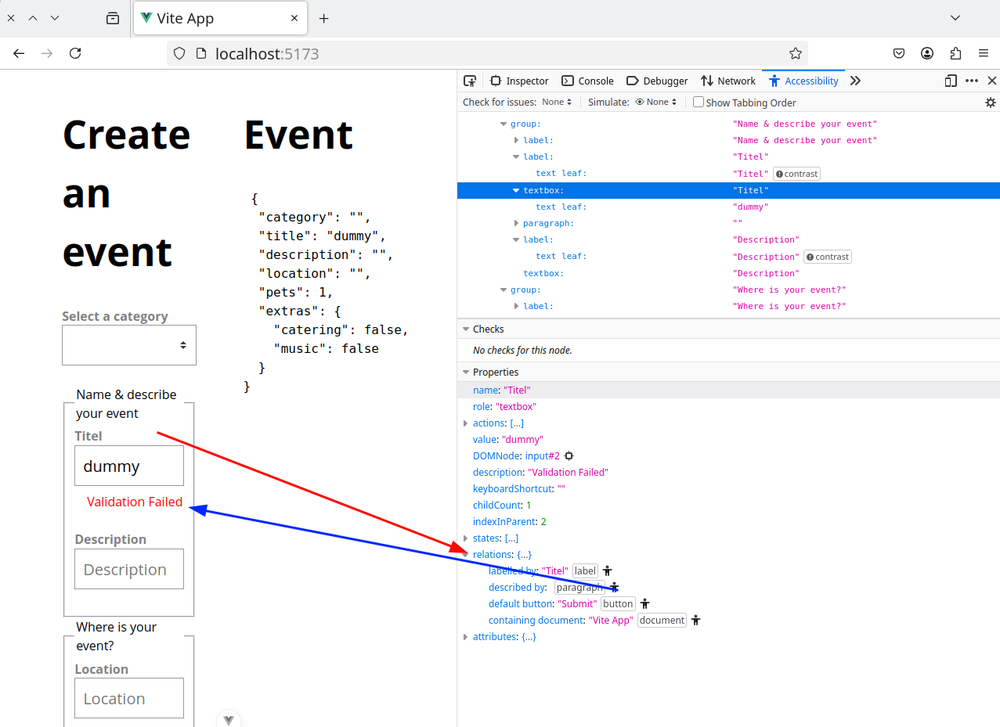
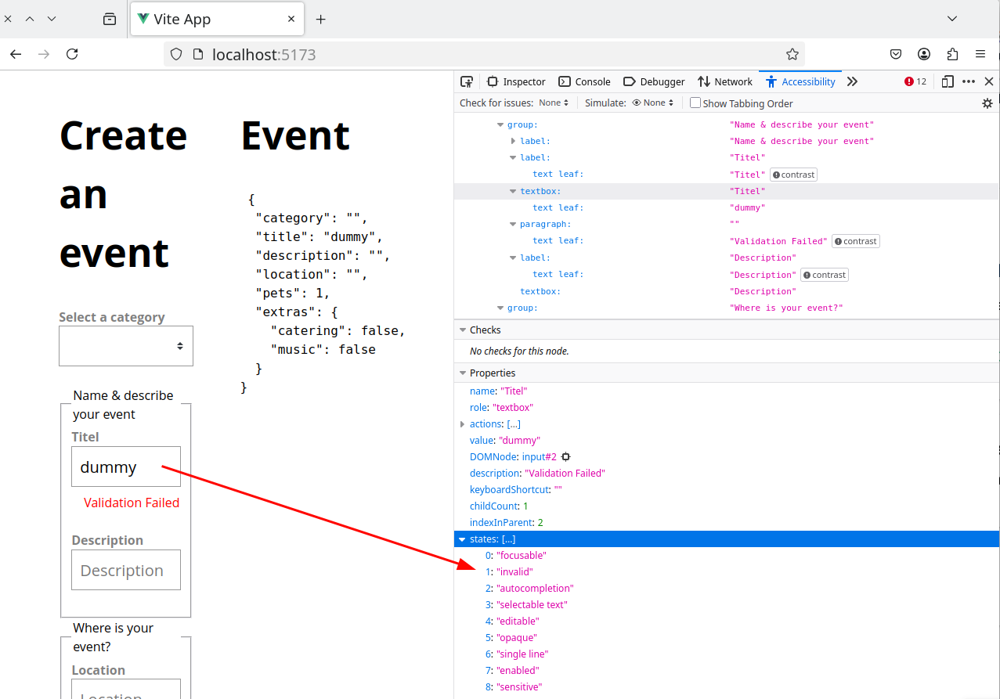

# [Vue3 Forms](https://www.vuemastery.com/courses/vue3-forms)

- [Vue3 Forms](#vue3-forms)
- [Some Caveats](#some-caveats)
  - [Variable Binding](#variable-binding)
  - [`$attr`s](#attrs)
  - [Checkbox 'checked' instead of 'value'](#checkbox-checked-instead-of-value)
  - [Forms](#forms)
- [Basic a11y for our components](#basic-a11y-for-our-components)
  - [Appropriate types](#appropriate-types)
  - [Use `form`](#use-form)
  - [Use `Fieldset` and `Legend`](#use-fieldset-and-legend)
  - [Do NOT rely on placeholders](#do-not-rely-on-placeholders)
  - [Labels](#labels)
  - [Accessible errors](#accessible-errors)
  - [Explicit input state](#explicit-input-state)
  - [Don’t disable the submit button](#dont-disable-the-submit-button)
- [Tools](#tools)


**!!! Official Guideline for dedicated Form Components see [vue3-Docs: Component v-model](https://vuejs.org/guide/components/v-model.html#basic-usage) !!!**

```vue
<!-- CustomInput.vue -->
<script>
export default {
  props: ['modelValue'] /** name is fix, but can be changed */,
  emits: ['update:modelValue'] /** name is fix! */,
}
</script>

<template>
  <input :value="modelValue" @input="$emit('update:modelValue', $event.target.value)" />
</template>
```

```vue
<CustomInput v-model="searchText" />
```

# Some Caveats

## Variable Binding

```
const placeholder = 'My Placeholder'
...

</script>

<template>
  <div>
    <input
      :placeholder="placeholder"  <- 'My Placeholder'
    />
    <input
      placeholder="placeholder"  <- 'placeholder'
    />
  </div>
</template>
```

## `$attr`s

Note that multiple Root-HTML-Elements - here `<label>,<input>` - do not inherit `$attrs` automatically,
but must define inheritance explicitly.

e.g. [BaseInput.vue](./src/components/BaseInput.vue)

```
const props = withDefaults(
  defineProps<{
    label?: string
    placeholder?: string
  }>(),
  { label: '', placeholder: '' },
)
const placeholder = props.placeholder || props.label

...

</script>

<template>
  <div>
    <label>{{ label }}</label>
    <input
      :placeholder="placeholder"
       v-bind="$attrs" <!-- type="text" is now inherited-->
    />
  </div>
</template>
```

## Checkbox 'checked' instead of 'value'

Checkbox inputs bind their state to a `checked` property, and not directly to `value`:

```
    <input
      type="checkbox"
      :checked="modelValue"   <!-- :checked !!! -->
      v-bind="$attrs"
      @change="emit('update:modelValue', ($event.target as HTMLInputElement).checked)"
    />
```

## Forms

- handle `@submit` at `form` (not at `button`)
- use `.prevent` to avoid further browser submit handling like page refresh
- set `type`s of the buttons: There should be 1 button with `type="submit"`
```
      <form @submit.prevent="handleSubmit">
        ...

        <button class="button -fill-gradient" type="submit">Submit</button>
        <button class="button -fill-warn-gradient" type="button" @click="reset">Reset</button>
      </form>
```

# Basic a11y for our components

Accessibility is not a secondary task that you come back to after your app is working. It is a primary concern that needs to be addressed as part of your development process.

In this course I decided to keep it separate for educational reasons, introducing one concept at a time and building upon those concepts incrementally. We now have the conceptual groundwork laid out to add in our accessibility features.

We will go over what I consider some of the very basic accessibility concepts that you need to keep fresh in mind when developing forms. These concepts are not technically Vue-specific, but we will learn how to apply them in the context of our Vue form components.

Let’s dive right in.

## Appropriate types

In HTML we have a wide variety of input elements to craft our forms, but one element in particular rules them all. The catch-all input allows us the flexibility of creating text inputs, but we can also transform it into checkboxes and radio buttons with the `type` property.

A common mistake is to ignore this `type` property when creating text inputs. Most of us know and commonly use two regularly: `type` `email` and `password`.

When using a specific type in an input element, not only do we get better autocompletion for our form, but it also allows screen readers to better understand what type of data we want to retrieve from the user. A type of `tel` for example, will provide the user on a mobile phone with a handy numeric keyboard with phone symbols like `+ * #`.

Your users with mobility problems will definitely be grateful for this one!

Bottom line: Don’t forget to set your `type`, even when the `input` is not of type `password` or `email`.

Here is a list of the available `type`s for an `input` element:

```
button
checkbox
color
date
datetime-local
email
file
hidden
image
month
number
password
radio
range
reset
search
submit
tel
text
time
url
week
```

## Use `form`

Each form needs a wrapping <form> tag. Screen readers often switch to “Forms Mode” when they are processing content within a <form> element. This gives users that use accessible technologies a better experience when navigating forms, and there is no reason to ever not do it.

There are many ways to trigger the submission of a form. A user can click or tab into a submit button and click it or hit enter. A user may also hit the enter key inside one of our fields. Screen readers will look for buttons with the `type="submit"` type on them.

## Use `Fieldset` and `Legend`

Two often overlooked or under-taught elements in HTML are `fieldset` and `legend`.

In forms, usually we group our inputs logically. For example, you would usually code your form to first ask the user for their personal data like Name, Last Name, and Phone. Later on, another section may ask them for a shipping address.

For accessible users, this information may not be as immediately available without having to tab through the whole form, this is where `<fieldset>` and `<legend>` come to play.

You should always try to wrap up sections of your form inside a `fieldset` element. This will logically group the inputs inside of it. Then, the first element of the `fieldset` will be a `legend` element which will provide a Title for that particular `fieldset`.

If for some reason you don’t want the `legend` to show on your form (usually because of design reasons), you can always position it absolutely, outside of the visible screen.

For our current form in `SimpleForm.vue`, we can wrap up our logical sections inside fieldset.

The Firefox accessibility tool shows:


## Do NOT rely on placeholders

A popular design pattern that emerged a few years ago used the `placeholder` attribute of inputs to describe the type of content that the element was expecting. Sadly this is still sometimes used now-a-days instead of a proper label.

Placeholders should only be used to describe the intended value, but not as a replacement for a descriptive label. Placeholders disappear whenever a user starts typing into the field, forcing the user to keep in mind what that field was expecting. Additionally, some users can have problems differentiating between a field with a `placeholder` and a field that has pre-populated or filled content.

As far as screen readers go, each screen reader may treat the `placeholder` attribute differently, but as long as a correctly set label is in place, it shouldn’t be much of a concern to leave it in.

## Labels

Speaking about labels, let’s talk about a really powerful accessibility feature that is sadly very commonly underused, or misused, in forms.

We have to link the label and the actual input field together: 
There are a few ways, the first one is to actually **nest** the input inside of the label element.
```
<label>
  Title
  <input />
</label>
```

This is one of the easiest ways to make sure that your input is always correctly linked to the related label, but I want to go into depth into the second and usually more “common” way to relate HTML elements because it’s going to come in handy later when we look at error messages. This method involves using **ID**s.

See [Uuid.ts](./src/composables/Uuid.ts) and [BaseInput.vue](./src/components/BaseInput.vue) for the implementation of the `ID` method:

```
<script setup lang="ts">
import UniqueId from '@/composables/Uuid';

const uuid = UniqueId().generateUuid().toString()

//...
</script>

<template>
  <label :for="uuid">{{ label }}</label>
  <input
    :id="uuid"
    v-bind="$attrs"
    :value="modelValue"
    :placeholder="placeholder"
    @input="emit('update:modelValue', ($event.target as HTMLInputElement)?.value)"
  />
</template>
```

Now the relation is known:



## Accessible errors

Have you ever filled out a form just to hit the submit button and nothing seemed to work? It was clearly not submitting, and there was no visible error anywhere, yet something was clearly wrong. This situation is not foreign to most Internet users, but imagine the exasperation when you require accessible tools and the form doesn’t easily tell you what’s wrong with your inputs.

Let’s first go into our `BaseInput.vue` component and add a new prop, error, that will allow us to set a String with an error message in case the component is in an error state.

[BaseInput.vue](./src/components/BaseInput.vue)
```
<script setup lang="ts">
import UniqueId from '@/composables/Uuid';

const uuid = UniqueId().generateUuid().toString()

//...
<script setup lang="ts">
// ...
const props = withDefaults(
  defineProps<{
    modelValue?: string | number
    label?: string
    placeholder?: string,
    error?: string
  }>(),
  { modelValue: '', label: '', placeholder: '' },
)
// ...
</script>

<template>
  <label :for="uuid">{{ label }}</label>
  <input
    :id="uuid"
    v-bind="$attrs"
    :value="modelValue"
    :placeholder="placeholder"
    :aria-describedby="error ? `${uuid}-error`: undefined"
    @input="emit('update:modelValue', ($event.target as HTMLInputElement)?.value)"
  />
  <p :id="`${uuid}-error`" v-if="error" class="errorMessage">{{ error }}</p>
</template>
```

[SimpleForm.vue](./src/views/SimpleForm.vue)
```
  <BaseInput
    label="Titel"
    placeholder="Title"
    type="text"
    :class="{ field: !inputError }"
    v-model="event.title"
    :error="inputError"
  >
  </BaseInput>

  <BaseInput
    label="Description"
    type="text"
    class="field"
    v-model="event.description"
  >
  </BaseInput>
```

Notice that we are appending the `-error` string to the UUID of the error messages paragraph. We need this identifier to be unique, and the UUID by itself is already in use by the input.

This id is set as a “description” for the input element with the `aria-describedby` attribute.



One more thing though… Because we are using `v-if` to display this information on and off, we want to make sure that screen readers announce/read it whenever it becomes displayed. To do this, we’re going to add an attribute of `aria-live="assertive"`. Another way would be to add a role attribute of “alert”, but I’ve found that the `aria-live` tends to work better with a variety of screen readers.

[BaseInput.vue](./src/components/BaseInput.vue)
```
  <p
    :id="`${uuid}-error`"
    v-if="error"
    aria-live="assertive"
    class="errorMessage"
  >{{ error }}</p>
```

## Explicit input state

Another thing we can quickly add to our input to make it even more accessible is the `aria-invalid` attribute. A mistake that I’ve seen many forms make is to try and rely on a red border around an invalid input. For obvious reasons, this is not accessible.

We’ve already taken steps into accessible errors, but let’s make sure to also notify screen readers on the invalid state of an input to provide better feedback for our users.

We are going to add the `aria-invalid` attribute to our input, and toggle it off and on depending on whether the `error` prop is set. When the input is valid, `undefined` will make it so that the attribute is not added to the input element:

[BaseInput.vue](./src/components/BaseInput.vue)
```
  <input
    :id="uuid"
    v-bind="$attrs"
    :value="modelValue"
    :placeholder="placeholder"
    :aria-describedby="error ? `${uuid}-error`: undefined"
    :aria-invalid="error ? true : undefined"
    @input="emit('update:modelValue', ($event.target as HTMLInputElement)?.value)"
  />
```

If we go back to the browser and inspect the input using the Accessibility tool on Firefox, we can see that the state of “invalid” has now been added to the active states of the input:



Other noteworthy states that we could also add attributes for are `readonly`, `disabled` and `required`. These three can be set directly with HTML5 attributes of the same name, or with their aria counterparts: `aria-readonly`, `aria-disabled`, and `aria-required`.

## Don’t disable the submit button

If a form is not valid, then it makes sense to set the disabled attribute to true on the submit button so that the user can’t submit the form, right? We can even style the button with a different color to convey that it won’t be clickable.

There’s a big problem with this though. Users that rely on screen readers will not get any feedback at all, the button will be completely ignored by the screen reader when tabbing through the form. This clearly can be very confusing and frustrating.

I suggest instead that you make any and all checks to make sure your form is valid before submitting it on the sendForm method that we created on the SimpleForm component. If everything checks out, we submit the form normally.

If something is wrong, then set the necessary errors in your form with the tools that we just learned to notify the user that something is wrong.

# Tools

- Firefox: DevTools#Accessibility